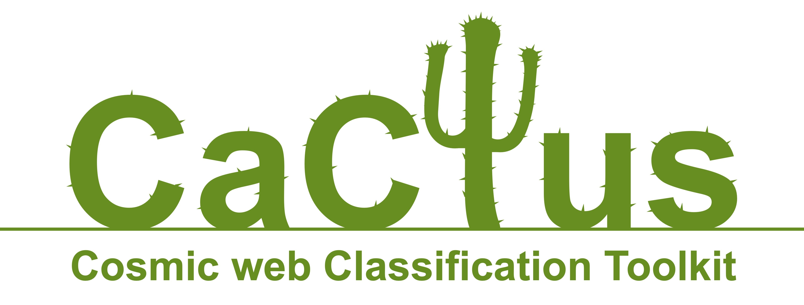

.. .. image:: https://badge.fury.io/py/magpie-pkg.svg
..    :target: https://badge.fury.io/py/magpie-pkg

.. .. image:: https://anaconda.org/knaidoo29/magpie-pkg/badges/version.svg
..    :target: https://anaconda.org/knaidoo29/magpie-pkg

.. .. image:: https://readthedocs.org/projects/cactus-doc/badge/?version=latest
..    :target: https://cactus-doc.readthedocs.io/en/latest/?badge=latest
..    :alt: Documentation Status

.. .. image:: https://circleci.com/gh/knaidoo29/magpie/tree/master.svg?style=svg
..    :target: https://circleci.com/gh/knaidoo29/magpie/tree/master

.. .. image:: https://codecov.io/gh/knaidoo29/magpie/branch/development/graph/badge.svg?token=P7H8FAJT43
..    :target: https://codecov.io/gh/knaidoo29/magpie

.. .. image:: https://anaconda.org/knaidoo29/magpie-pkg/badges/license.svg
..    :target: https://anaconda.org/knaidoo29/magpie-pkg

Contents
========

* `Introduction`_
* `Dependencies`_
* `Installation`_
* `Tutorials and API`_
* `Contributors`_
* `Support`_
* `Version History`_

Introduction
============

The **Cosmic web Classification Toolkit** or **CaCTus** for short, is a public
python library for classifying cosmological fields into different cosmic web
environments. The package is designed to work directly from simulation particles
to the computation of cosmic web environments using either the T-web, V-web or
NEXUS algorithms.

CaCTus is designed with the intent of making reliable cosmic web classification
algorithms readily available to the community and allowing us to tackle some of the
challenges presented by modern cosmological observations. Including better
understanding of higher-order statistical information contained in the cosmic web
as well as the role of environments on galaxy formation and evolution.

Dependencies
============

CaCTus is being developed in ``Python 3.9`` but should work on all ``versions >=3.4``.
CaCTus is written mostly in ``python``, with some backend functions written in ``fortran``.
For this reason a ``fortran`` compiler is required and we are limited to a version of
``numpy`` which still contains ``distutils`` (i.e a ``version < 1.23``).

For installation on a local machine, a gnu ``fortran`` compiler can be installed from
`GFortran <https://gcc.gnu.org/wiki/GFortran>`_ while for installations on a HPC,
this can usually be satisfied by simply loading a gnu compiler. Once ``fortran``
has been installed you will need the following ``python`` packages:

* `h5py <https://www.h5py.org/>`_
* `numpy <http://www.numpy.org/>`_
* `mpi4py <https://mpi4py.readthedocs.io/en/stable/>`_
* `pyyaml <https://pyyaml.org/>`_
* `scipy <http://scipy.org/>`_

Installation
============

.. CaCTus can be installed in a variety of ways -- using ``conda``, ``pip`` or by
.. directly cloning the repository. If you are having trouble installing or
.. running CaCTus we recommend using the conda install as this will setup the
.. environment.

.. #. Using ``conda``::

..    conda install -c knaidoo29 cactus

.. #. Using ``pip``::

..    pip install cactus

Clone the github repository and run the following

.. code-block:: bash

    git clone https://github.com/knaidoo29/cactus.git
    cd CACTUS
    python setup.py build
    python setup.py install

Once this is done you should be able to call CaCTus from python:

.. code-block:: python

    import cactus

which will allow you to use CaCTus directly as an imported module. However, in
most cases you will want to use the cactus-run.py script located in the ``scripts/``
folder. This script is designed to run at scale, parallelised using ``OpenMPI``,
and can handle the generation of density and velocity fields to the cosmic web
classification maps. The scripts takes a ``yaml`` parameter file -- an example is
also located in the ``scripts/`` folder. To run the script (across 4 cores), you
simply run the following

.. code-block:: bash

    mpirun -np 4 python cactus-run.py params.yaml

taking care to copy the ``cactus-run.py`` scripts to the directory where you are running.
It is important to note that you should never need to edit the ``cactus-run.py`` script
but rather the input parameter files.

Tutorials and API
=================

.. toctree::
  :maxdepth: 2

  api

Contributors
============

CaCTus was written by `Krishna Naidoo` in collaboration with `Wojciech Hellwing`.

The software products have been extensively tested by the Computational Cosmology
Group at the Center for Theoretical Physics at the Polish Academy of Sciences,
in particular by `Feven Hunde` and `Oliver Newton`. Additional testing was
also provided by `Simon Pfeifer` and `Mariana Jaber`.

If you would like to add additional tools or algorithms to the CaCTus package,
please get in touch.

Support
=======

If you have any issues with the code or want to suggest ways to improve it please
open a new issue (`here <https://github.com/knaidoo29/cactus/issues>`_) or
(if you don't have a github account) email krishna.naidoo.11@ucl.ac.uk.

Version History
===============

* **Version 0.0.0**:
